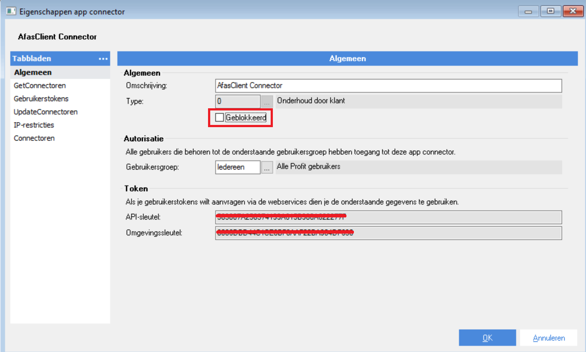
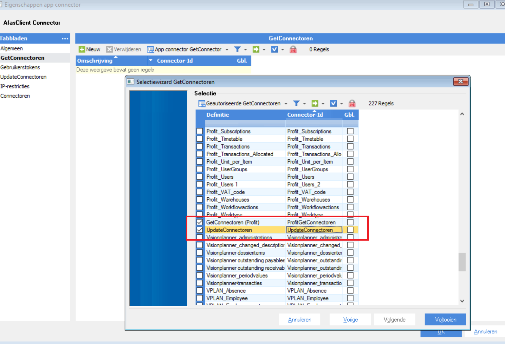
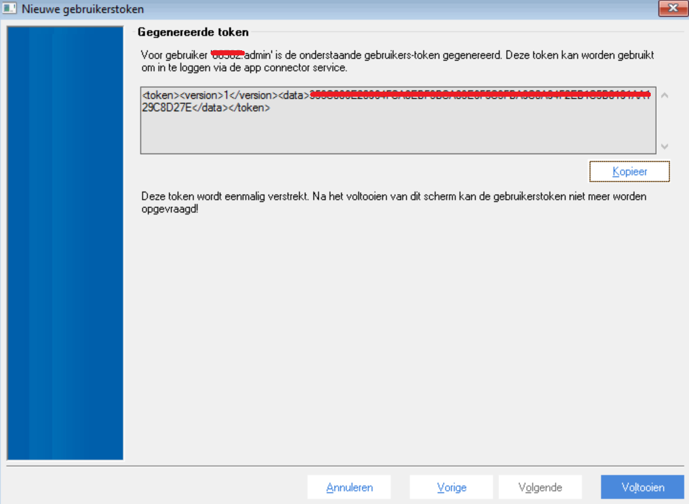

# Setup an AppConnector in Afas for your project

An AppConnector in Afas defines the set of GetConnectors and UpdateConnectors you want to use in your application.

> Note. This setup is listed here for your convenience. But the official documentation is listed on [help.afas.nl](https://help.afas.nl).

1. Define an appconnector

Follow the menu path `\Algemeen \Beheer \App Connector` to add a new AppConnector. Make sure it is unblocked.  

2. Include the get and update connectors

Proceed to the tabs : `GetConnectoren` and `UpdateConnectoren` to select all the connectors you need in your project. 

> Make sure to include at least the two GetConnectors called `GetConnectoren` and `UpdateConnectoren` as shown below. These two are used by the code generation templates to discover the selected get- and updateconnectors in this AppConnector.

3. Get your token

Proceed to the tab: `Gebruikerstoken` and generate your Token.

